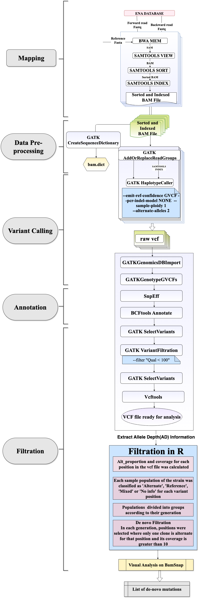

# Estimating the Micro-Indel Mutation Rate in *Plasmodium falciparum*

This repository contains information from my S3 Master's thesis project at the University of Montpellier, titled:\
**"Estimating the micro-indel mutation rate in *Plasmodium falciparum* using genomes from mutation accumulation experiments."**

The project was carried out at LPHI (Laboratory of Host-Pathogen Interactions) under the supervision of Dr. Antoine Classens (PI) and Marc Antoine Guery, from September 2020 to February 2021.

------------------------------------------------------------------------

## Table of Contents

-   [Repository Structure](#repository-structure)
    -   [Pipeline](#pipeline)
    -   [Test Scripts](#test-scripts)
    -   [Internship Results](#internship-results)
-   [Additional Resources](#additional-resources)
-   [Important Note](#important-note)

------------------------------------------------------------------------

## Repository Structure {#repository-structure}

This repository contains three main folders:

### Pipeline {#pipeline}

-   Contains the main scripts used in the analysis pipeline.
-   The schematic below illustrates the major steps in the pipeline:

For more details about the pipeline and each step, see: `Internship_results/S3_report_Aakanksha_Singh.pdf`

------------------------------------------------------------------------

### Test Scripts {#test-scripts}

-   Includes test scripts and their documentation.\
-   Provides insight into how I coded during the project.\
-   Explore this folder to see the scripts and the corresponding documentation.

------------------------------------------------------------------------

### Internship Results {#internship-results}

-   Contains the full Master's thesis report.\
-   Includes the presentation used to summarize the project for quick reference.\
-   Useful for reviewing both my writing and presentation skills.

------------------------------------------------------------------------

## Additional Resources {#additional-resources}

For an overview of the scripts and tools used in the analysis, see: `summary_of_the_update_meetings.pptx`

This presentation was used to update my supervisors during project meetings. It also served as a way for me to keep track of what I was testing and developing. Looking back, it's a valuable resource for understanding how the project was organized.

------------------------------------------------------------------------

## Important Note {#important-note}

The project continued after the internship ended, and a manuscript draft is currently in preparation.\
Because of this, not all results and data generated during the project can be shared in this repository.

The raw files used in the analysis can be found in the following study:

William L. Hamilton, Antoine Claessens, Thomas Otto, Mihir Kekre, Rick M. Fairhurst, *et al.*\
**Extreme mutation bias and high AT content in *Plasmodium falciparum***\
*Nucleic Acids Research*, 2016, gkw1259.\
[DOI](https://doi.org/10.1093/nar/gkw1259) \| [HAL entry](https://hal.science/hal-01989279)
